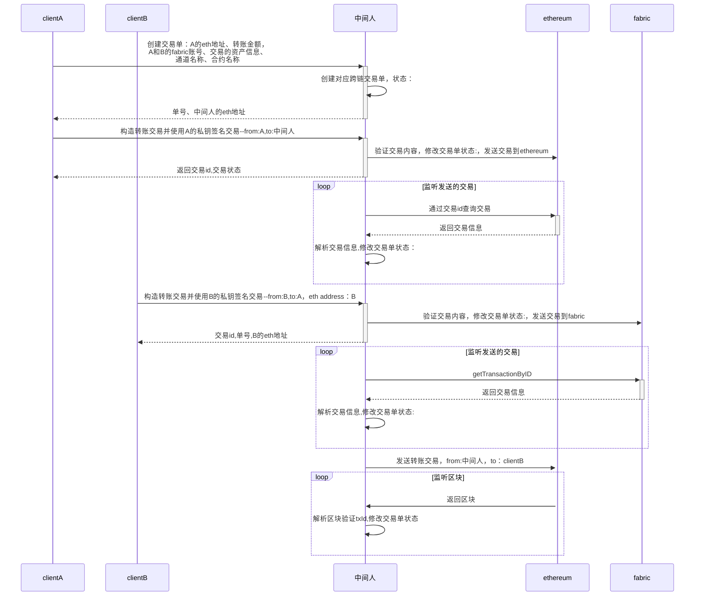

[![](https://mermaid.ink/img/eyJjb2RlIjoic2VxdWVuY2VEaWFncmFtXG5cdHBhcnRpY2lwYW50IGNsaWVudEFcblx0cGFydGljaXBhbnQgY2xpZW50QlxuXHRwYXJ0aWNpcGFudCDkuK3pl7Tkurpcblx0cGFydGljaXBhbnQgZXRoZXJldW1cblx0cGFydGljaXBhbnQgZmFicmljXG5cdFxuXHQj5Yib5bu66Leo6ZO-5Lqk5piT5Y2VXG5cdGNsaWVudEEgLT4-ICsg5Lit6Ze05Lq6OuWIm-W7uuS6pOaYk-WNle-8mkHnmoRldGjlnLDlnYDjgIHovazotKbph5Hpop3vvIw8YnI-QeWSjELnmoRmYWJyaWPotKblj7fjgIHkuqTmmJPnmoTotYTkuqfkv6Hmga_jgIE8YnI-6YCa6YGT5ZCN56ew44CB5ZCI57qm5ZCN56ewXG5cdOS4remXtOS6uiAtPj4g5Lit6Ze05Lq6OiDliJvlu7rlr7nlupTot6jpk77kuqTmmJPljZXvvIznirbmgIHvvJpcblx05Lit6Ze05Lq6IC0tPj4gLWNsaWVudEE65Y2V5Y-344CB5Lit6Ze05Lq655qEZXRo5Zyw5Z2AXG5cdFxuXHQj56ys5LiA5qyh5Lul5aSq5Lqk5piT77yaQS0-5Lit6Ze05Lq6XG5cdGNsaWVudEEgLT4-KyDkuK3pl7Tkuro6IOaehOmAoOi9rOi0puS6pOaYk-W5tuS9v-eUqEHnmoTnp4HpkqXnrb7lkI3kuqTmmJMtLWZyb206QSx0bzrkuK3pl7Tkurpcblx05Lit6Ze05Lq6LT4-IGV0aGVyZXVtOiDpqozor4HkuqTmmJPlhoXlrrnvvIzkv67mlLnkuqTmmJPljZXnirbmgIE677yM5Y-R6YCB5Lqk5piT5YiwZXRoZXJldW1cblx05Lit6Ze05Lq6IC0tPj4tIGNsaWVudEE6IOi_lOWbnuS6pOaYk2lkLOS6pOaYk-eKtuaAgVxuXHRcblx0bG9vcCDnm5HlkKzlj5HpgIHnmoTkuqTmmJNcblx0XHTkuK3pl7TkurogLT4-KyBldGhlcmV1bTrpgJrov4fkuqTmmJNpZOafpeivouS6pOaYk1xuXHRcdGV0aGVyZXVtIC0tPj4tIOS4remXtOS6ujrov5Tlm57kuqTmmJPkv6Hmga9cblx0XHTkuK3pl7TkurogLT4-IOS4remXtOS6ujrop6PmnpDkuqTmmJPkv6Hmga8s5L-u5pS55Lqk5piT5Y2V54q25oCB77yaXG5cdGVuZFxuXHRcblx0I-esrOS6jOasoWZhYnJpY-S6pOaYkzpCLT5BXG5cdGNsaWVudEIgLT4-KyDkuK3pl7Tkuro65p6E6YCg6L2s6LSm5Lqk5piT5bm25L2_55SoQueahOengemSpeetvuWQjeS6pOaYky0tZnJvbTpCLHRvOkHvvIxldGggYWRkcmVzc--8mkJcblx05Lit6Ze05Lq6IC0-PiBmYWJyaWM66aqM6K-B5Lqk5piT5YaF5a6577yM5L-u5pS55Lqk5piT5Y2V54q25oCBOu-8jOWPkemAgeS6pOaYk-WIsGZhYnJpY1xuXHTkuK3pl7TkurotLT4-LSBjbGllbnRCOiDkuqTmmJNpZCzljZXlj7csQueahGV0aOWcsOWdgFxuXHRcblx0bG9vcCDnm5HlkKzlj5HpgIHnmoTkuqTmmJNcblx0XHTkuK3pl7TkurogLT4-KyBmYWJyaWM6Z2V0VHJhbnNhY3Rpb25CeUlEXG5cdFx0ZmFicmljIC0tPj4tIOS4remXtOS6ujrov5Tlm57kuqTmmJPkv6Hmga9cblx0XHTkuK3pl7TkurogLT4-IOS4remXtOS6ujrop6PmnpDkuqTmmJPkv6Hmga8s5L-u5pS55Lqk5piT5Y2V54q25oCBOlxuXHRlbmRcblx0XG5cdCPnrKzkuInmrKHku6XlpKrkuqTmmJPvvJrkuK3pl7TkurotPkJcblx05Lit6Ze05Lq6LT4-KyBldGhlcmV1bTog5Y-R6YCB6L2s6LSm5Lqk5piT77yMZnJvbTrkuK3pl7TkurrvvIx0b--8mmNsaWVudEJcblx0XG5cdGxvb3Ag55uR5ZCs5Yy65Z2XXG5cdFx0ZXRoZXJldW0gLT4-IOS4remXtOS6ujrov5Tlm57ljLrlnZdcblx0XHTkuK3pl7TkurogLT4-IOS4remXtOS6ujrop6PmnpDljLrlnZfpqozor4F0eElkLOS_ruaUueS6pOaYk-WNleeKtuaAgVxuXHRlbmRcbiAgICAgICAgICAgICIsIm1lcm1haWQiOnsidGhlbWUiOiJkZWZhdWx0In0sInVwZGF0ZUVkaXRvciI6ZmFsc2V9)](https://mermaid-js.github.io/mermaid-live-editor/#/edit/eyJjb2RlIjoic2VxdWVuY2VEaWFncmFtXG5cdHBhcnRpY2lwYW50IGNsaWVudEFcblx0cGFydGljaXBhbnQgY2xpZW50QlxuXHRwYXJ0aWNpcGFudCDkuK3pl7Tkurpcblx0cGFydGljaXBhbnQgZXRoZXJldW1cblx0cGFydGljaXBhbnQgZmFicmljXG5cdFxuXHQj5Yib5bu66Leo6ZO-5Lqk5piT5Y2VXG5cdGNsaWVudEEgLT4-ICsg5Lit6Ze05Lq6OuWIm-W7uuS6pOaYk-WNle-8mkHnmoRldGjlnLDlnYDjgIHovazotKbph5Hpop3vvIw8YnI-QeWSjELnmoRmYWJyaWPotKblj7fjgIHkuqTmmJPnmoTotYTkuqfkv6Hmga_jgIE8YnI-6YCa6YGT5ZCN56ew44CB5ZCI57qm5ZCN56ewXG5cdOS4remXtOS6uiAtPj4g5Lit6Ze05Lq6OiDliJvlu7rlr7nlupTot6jpk77kuqTmmJPljZXvvIznirbmgIHvvJpcblx05Lit6Ze05Lq6IC0tPj4gLWNsaWVudEE65Y2V5Y-344CB5Lit6Ze05Lq655qEZXRo5Zyw5Z2AXG5cdFxuXHQj56ys5LiA5qyh5Lul5aSq5Lqk5piT77yaQS0-5Lit6Ze05Lq6XG5cdGNsaWVudEEgLT4-KyDkuK3pl7Tkuro6IOaehOmAoOi9rOi0puS6pOaYk-W5tuS9v-eUqEHnmoTnp4HpkqXnrb7lkI3kuqTmmJMtLWZyb206QSx0bzrkuK3pl7Tkurpcblx05Lit6Ze05Lq6LT4-IGV0aGVyZXVtOiDpqozor4HkuqTmmJPlhoXlrrnvvIzkv67mlLnkuqTmmJPljZXnirbmgIE677yM5Y-R6YCB5Lqk5piT5YiwZXRoZXJldW1cblx05Lit6Ze05Lq6IC0tPj4tIGNsaWVudEE6IOi_lOWbnuS6pOaYk2lkLOS6pOaYk-eKtuaAgVxuXHRcblx0bG9vcCDnm5HlkKzlj5HpgIHnmoTkuqTmmJNcblx0XHTkuK3pl7TkurogLT4-KyBldGhlcmV1bTrpgJrov4fkuqTmmJNpZOafpeivouS6pOaYk1xuXHRcdGV0aGVyZXVtIC0tPj4tIOS4remXtOS6ujrov5Tlm57kuqTmmJPkv6Hmga9cblx0XHTkuK3pl7TkurogLT4-IOS4remXtOS6ujrop6PmnpDkuqTmmJPkv6Hmga8s5L-u5pS55Lqk5piT5Y2V54q25oCB77yaXG5cdGVuZFxuXHRcblx0I-esrOS6jOasoWZhYnJpY-S6pOaYkzpCLT5BXG5cdGNsaWVudEIgLT4-KyDkuK3pl7Tkuro65p6E6YCg6L2s6LSm5Lqk5piT5bm25L2_55SoQueahOengemSpeetvuWQjeS6pOaYky0tZnJvbTpCLHRvOkHvvIxldGggYWRkcmVzc--8mkJcblx05Lit6Ze05Lq6IC0-PiBmYWJyaWM66aqM6K-B5Lqk5piT5YaF5a6577yM5L-u5pS55Lqk5piT5Y2V54q25oCBOu-8jOWPkemAgeS6pOaYk-WIsGZhYnJpY1xuXHTkuK3pl7TkurotLT4-LSBjbGllbnRCOiDkuqTmmJNpZCzljZXlj7csQueahGV0aOWcsOWdgFxuXHRcblx0bG9vcCDnm5HlkKzlj5HpgIHnmoTkuqTmmJNcblx0XHTkuK3pl7TkurogLT4-KyBmYWJyaWM6Z2V0VHJhbnNhY3Rpb25CeUlEXG5cdFx0ZmFicmljIC0tPj4tIOS4remXtOS6ujrov5Tlm57kuqTmmJPkv6Hmga9cblx0XHTkuK3pl7TkurogLT4-IOS4remXtOS6ujrop6PmnpDkuqTmmJPkv6Hmga8s5L-u5pS55Lqk5piT5Y2V54q25oCBOlxuXHRlbmRcblx0XG5cdCPnrKzkuInmrKHku6XlpKrkuqTmmJPvvJrkuK3pl7TkurotPkJcblx05Lit6Ze05Lq6LT4-KyBldGhlcmV1bTog5Y-R6YCB6L2s6LSm5Lqk5piT77yMZnJvbTrkuK3pl7TkurrvvIx0b--8mmNsaWVudEJcblx0XG5cdGxvb3Ag55uR5ZCs5Yy65Z2XXG5cdFx0ZXRoZXJldW0gLT4-IOS4remXtOS6ujrov5Tlm57ljLrlnZdcblx0XHTkuK3pl7TkurogLT4-IOS4remXtOS6ujrop6PmnpDljLrlnZfpqozor4F0eElkLOS_ruaUueS6pOaYk-WNleeKtuaAgVxuXHRlbmRcbiAgICAgICAgICAgICIsIm1lcm1haWQiOnsidGhlbWUiOiJkZWZhdWx0In0sInVwZGF0ZUVkaXRvciI6ZmFsc2V9)
> todo：

- 使用语言：go|~~node~~
- 跨链交易单存储：~~文件~~|db|~~区块~~
- 版本：fabric 2.2、ethereum、sdk
- 交易限制：
  - fabric不能多次交易，不能影响非跨链交易
  - clientA取消交易限制
  - ...
- 跨链交易单状态流转：
  - created
  - escrow
  - transfer
  - settlement
  - canceled
  - ...
- 交易判断方式：块监听|通过交易id查询交易
- 以太交易校验方式：合约|普通账户


交易流程：

1.  register  Cross-chain transaction：A的eth地址、转账金额，A和B的fabric账号、交易的资产信息、通道名称、合约名称
2.  ETH-transfer：A -> 中间人
3. 更新注册收据状态：verify eth txid
4.  fabric-transfer：B -> A
5.  更新注册收据状态：verify fabric txid
6.  ETH-transfer：中间人 -> B
7.  confirm transaction completion：verify eth transaction 


> bug

- 一个ETH txid绑定多个Cross-chain register  receipt
- A同时注册两个跨链交易：仅eth转账金额不一样，B完成fabric交易后，A将txid绑定到金额较低的register  receipt


> 原因:

- register  receipt和ETH txid绑定
- register  receipt和fabric txid绑定


> 解决方案

1. 通过中间人发送交易
2. 中间人以服务的形式处理跨链操作

> 中间人服务        

中间人服务包含以下功能模块
1. create Cross-chain tx
2. list Cross-chain tx
3. monitor tx with Cross-chain txid
4. verify each transaction(from, to, amount, channel)
5. commit final transaction both side

> ```中间人服务``` 开发内容

##### client

1. 构造ETH及fabric交易并签名   2+2+2 
2. 发起跨链交易请求并返回跨链交易标识（index or cross-chain txid）1+2
3. 查询、展示跨链交易信息 1


##### cross-chain transaction service

1. 创建cross-chain tx  
2. 数据库增删改查接口
3. 交易查询修改  2
4. 交易校验（ETH && fabric） 1 + 1
5. 监听交易执行结果 0.5 + 0.5
6. 确认跨链交易，并构造发起最终确认交易（包含ETH以及Fabric）0.5 + 0.5


##### 网络搭建及模块集成

* ETH 私网搭建 0.5
    * 创建账户 
    * 配置协作账户
* Fabric 网络搭建 1.5
    * 网络部署
    * chain-code 安装
    
    
##### test && debug
 
 pending : 1 + 1  

##### 推文

2 + 2 

``` total: 24/2 = 12day ```

##### open issue

1. fabric go-sdk 需改造源码，实现构造和发送交易接口（签名，背书，发送）
2. grpc
3. rollback not considered